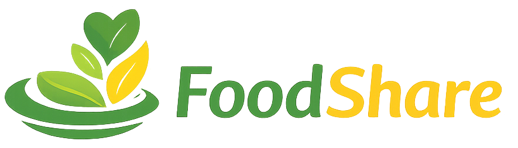
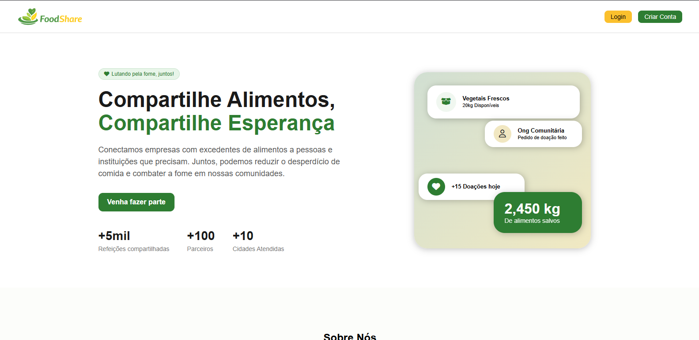
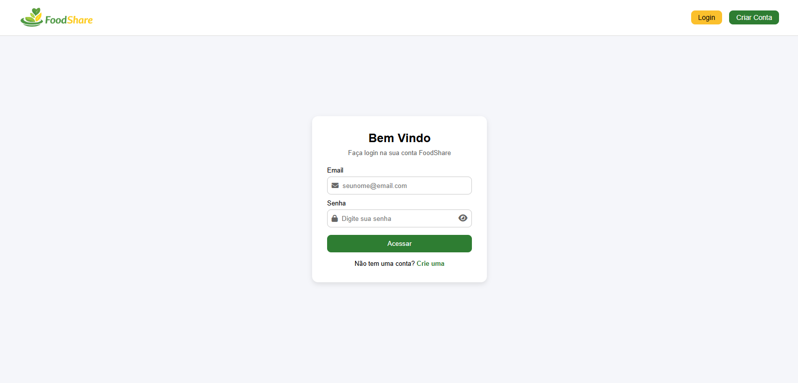
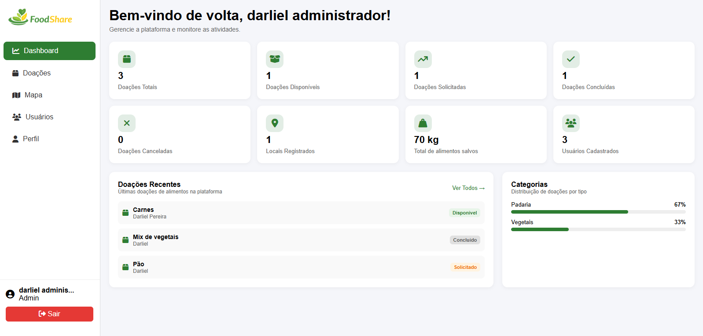
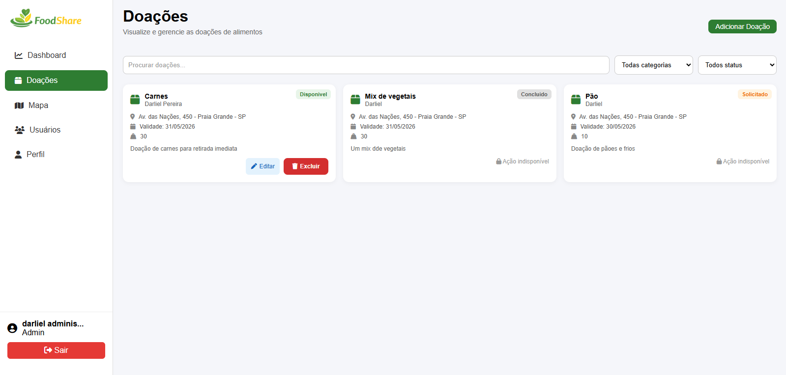
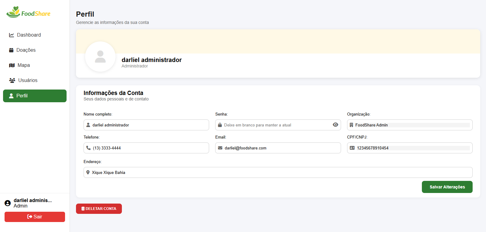
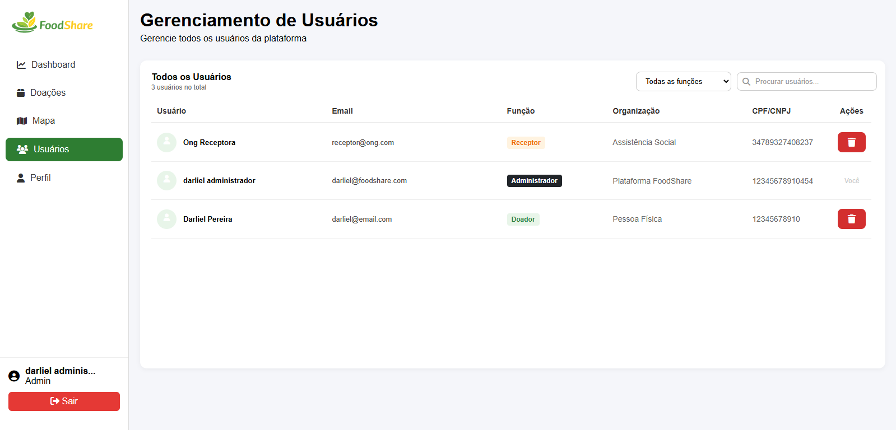

<div align="center">



# 🍃 FoodShare

### Plataforma de Doação de Alimentos

**Conectando quem tem excedente a quem precisa — reduzindo o desperdício, combatendo a fome.**

[](https://php.net)
[](https://mysql.com)
[](https://developer.mozilla.org/pt-BR/docs/Web/CSS)
[](https://developer.mozilla.org/pt-BR/docs/Web/JavaScript)
[](LICENSE)

</div>

---

## 📋 Sobre o Projeto

O **FoodShare** é uma aplicação web desenvolvida como Trabalho de Conclusão de Curso (TCC), com o objetivo de facilitar a doação de alimentos entre empresas, pessoas físicas e instituições sociais.

A plataforma conecta **doadores** — restaurantes, mercados, padarias e pessoas com excedente de alimentos — a **instituições receptoras** como ONGs, abrigos e cozinhas comunitárias, promovendo o reaproveitamento de alimentos e o combate à insegurança alimentar.

---

## ✨ Funcionalidades

### Para Doadores
- Cadastro e publicação de doações de alimentos
- Gerenciamento das próprias doações (editar, excluir)
- Acompanhamento do status das doações (Disponível → Solicitado → Concluído)

### Para Instituições (Receptores)
- Visualização de todas as doações disponíveis
- Solicitação de doações com um clique
- Confirmação de recebimento após a entrega
- Mapa com localização dos pontos de doação

### Para Administradores
- Dashboard com métricas da plataforma (total de doações, kg doados, usuários)
- Gerenciamento completo de usuários
- Visão geral das doações por categoria e status
- Exclusão de contas e moderação

### Geral
- Sistema de autenticação seguro com sessões
- Filtros de busca por título, status e categoria
- Paginação das doações
- Interface responsiva com sidebar recolhível

---

## 🖥️ Tecnologias Utilizadas

| Camada | Tecnologia |
|---|---|
| Back-end | PHP 8.x (puro, arquitetura MVC) |
| Banco de dados | MySQL com PDO |
| Front-end | HTML5, CSS3 personalizado, JavaScript Vanilla |
| Ícones | Font Awesome 6.5 |
| Mapa | Leaflet.js |

---

## 🗂️ Estrutura do Projeto

```
FoodShare/
│
├── Controller/              # Lógica de ação (recebem POST/GET e operam o banco)
│   ├── LoginController.php
│   ├── CadastroController.php
│   ├── NovaDoacaoController.php
│   ├── EditarDoacaoController.php
│   ├── ExcluirDoacaoController.php
│   ├── SolicitarDoacaoController.php
│   ├── ConfirmarEntregaController.php
│   ├── AtualizarPerfilController.php
│   ├── ExcluirMinhaContaController.php
│   ├── ExcluirUsuarioController.php
│   └── LogoutController.php
│
├── Model/                   # Classes de acesso ao banco de dados
│   ├── ConexaoBD.php        # Classe de conexão PDO
│   ├── Usuario.php          # Cadastro e busca de usuários
│   └── Doacao.php           # Listagem e cadastro de doações
│
├── View/                    # Páginas HTML/PHP exibidas ao usuário
│   ├── login.php
│   ├── cadastro.php
│   ├── doacoes.php
│   ├── nova_doacao.php
│   ├── perfil.php
│   ├── dashboard.php
│   ├── usuarios.php
│   └── mapa.php
│
├── includes/                # Componentes reutilizáveis de layout
│   ├── header.php
│   ├── sidebar.php
│   └── components/
│       ├── cards.php
│       ├── cards_doacao.php
│       ├── filtros_doacoes.php
│       ├── categorias.php
│       ├── doacoes_recentes.php
│       └── mapa_foodshare.php
│
├── js/                      # Scripts JavaScript
│   ├── validacoes.js
│   ├── doacoes.js
│   ├── filtros_usuarios.js
│   └── mapa.js
│
├── css/
│   └── style.css
│
├── img/
│   └── logo.png
│
├── database/                # Banco de dados
│   └── foodshare.sql
│
└── index.php                # Landing page pública
```

---

## 🔐 Tipos de Usuário

O sistema possui três perfis de acesso com permissões distintas:

| Perfil | Acesso |
|---|---|
| **Doador** | Cadastra e gerencia suas próprias doações |
| **Instituição (Receptor)** | Visualiza e solicita doações disponíveis |
| **Administrador** | Acesso total: dashboard, usuários e doações |

---

## 🗃️ Banco de Dados

O sistema utiliza as seguintes tabelas principais:

| Tabela | Descrição |
|---|---|
| `usuarios` | Dados de todos os usuários (nome, email, senha, tipo) |
| `doadores` | Dados específicos de doadores (CPF/CNPJ, tipo: PF ou PJ) |
| `instituicoes` | Dados de instituições receptoras (CNPJ, área de atuação) |
| `doacoes` | Registro de doações (descrição, categoria, peso, status, endereço) |

---

## 🔒 Segurança

- Senhas armazenadas com `password_hash()` (bcrypt)
- Todas as queries utilizam **PDO com prepared statements** (prevenção de SQL Injection)
- Controle de acesso por sessão em todas as rotas protegidas
- Saídas de dados protegidas com `htmlspecialchars()` (prevenção de XSS)
- Validação de inputs com `FILTER_VALIDATE_EMAIL` e `FILTER_VALIDATE_INT`

---

## 📸 Telas do Sistema

| Landing Page | Tela de Login | Dashboard Admin |
|---|---|---|
|  |  |  |

| Lista de Doações | Perfil do Usuário | Gerenciamento de Usuários |
|---|---|---|
|  |  |  |

---

## 👨‍💻 Autores

Desenvolvido como Trabalho de Conclusão de Curso.

**Darliel Pereira de Oliveira Rocha (Scrum Master)**

[](https://linkedin.com/in/darlielp)
[](https://github.com/darlielp)

**Iago Rodrigues (Product Owner)**

[](#)
[](https://github.com/rodrigues-iago)

**Matheus Maciel da Costa (Desenvolvedor)**

[](#)
[](https://github.com/maciel07-creator)

**Victor Pedroso Bertoldo (Desenvolvedor)**

[](#)
[](https://github.com/victorpedrosobertoldo-wq)

**Yasmin Augusto Peixoto (Desenvolvedora)**

[](#)
[](https://github.com/yas-augusto)

---

## 📄 Licença

Este projeto está sob a licença MIT. Veja o arquivo [LICENSE](LICENSE) para mais detalhes.

---

<div align="center">
  <sub>Feito com 💚 para reduzir o desperdício e combater a fome.</sub>
</div>
